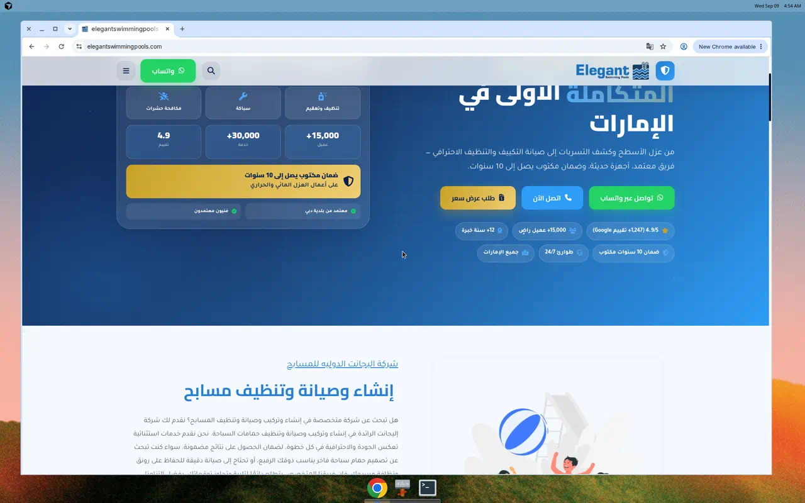
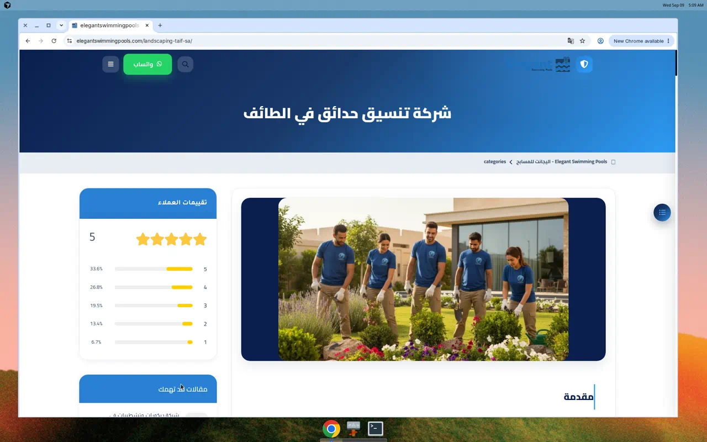
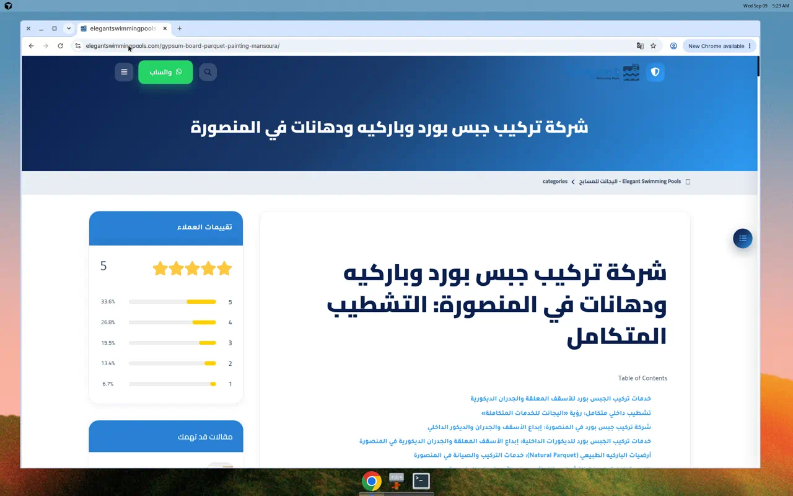
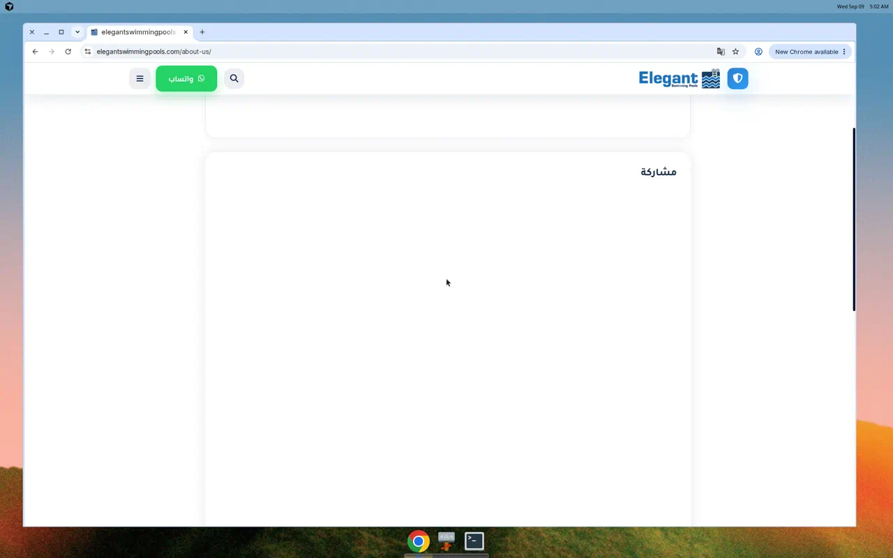
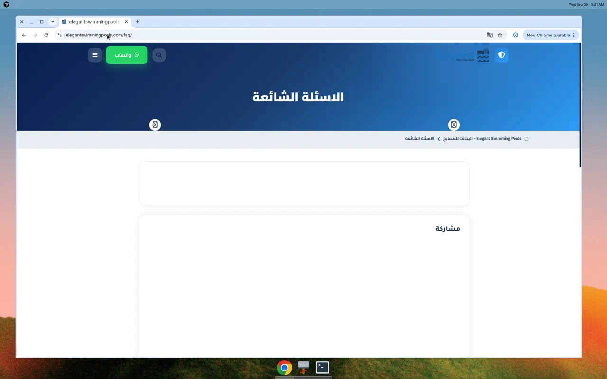
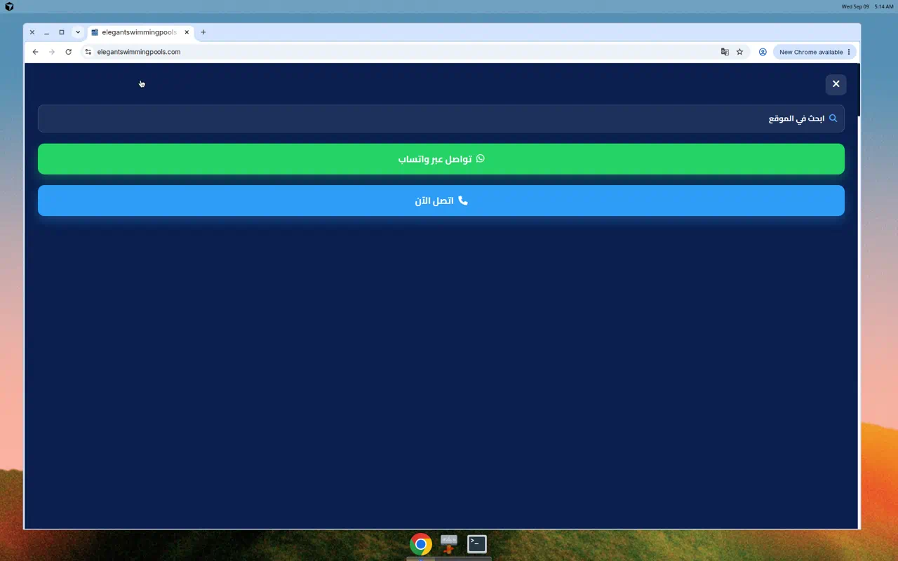
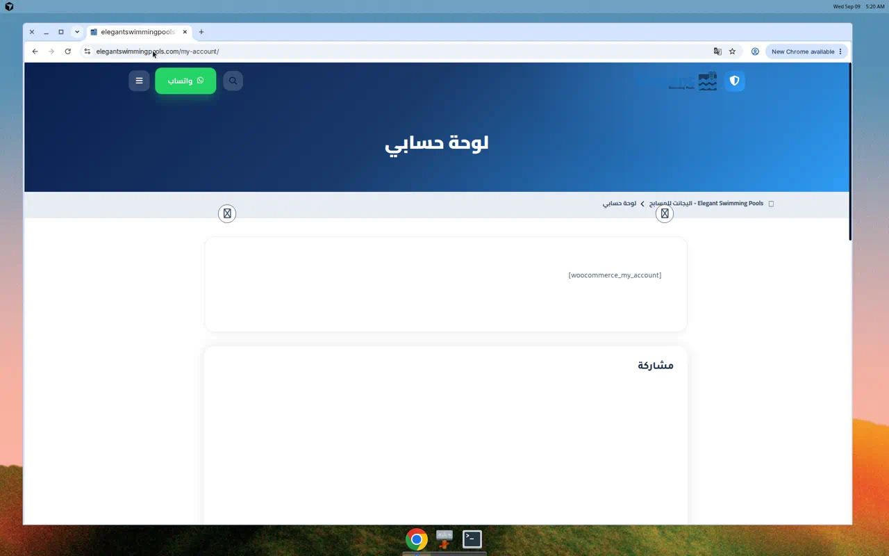
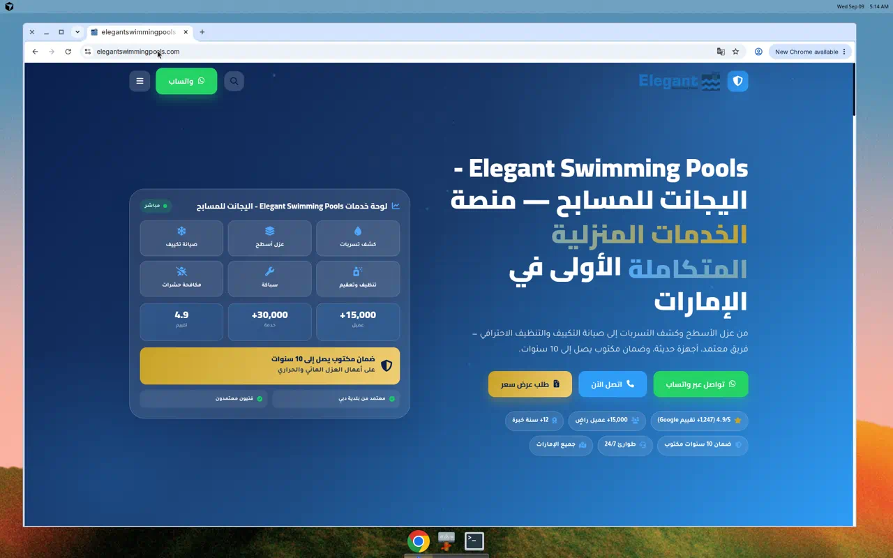
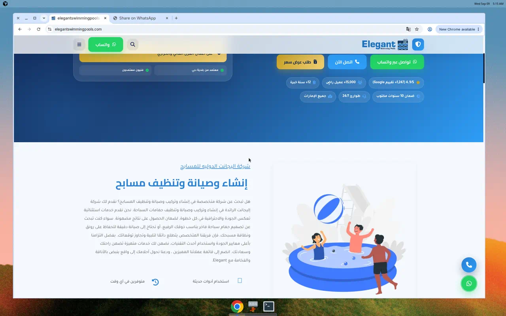

# تقرير تدقيق موقع Elegant Swimming Pools

**الموقع:** https://elegantswimmingpools.com  
**تاريخ الفحص:** 9 سبتمبر 2026  
**طريقة الفحص:** الواجهة العامة + لوحة ووردبريس عبر REST API بحساب مدير مصرّح + تصفح فعلي للحاسوب والجوال.

> لا يحتوي هذا الملف على كلمات مرور. بعد انتهاء التدقيق يُفضّل إلغاء كلمة مرور التطبيقات المستخدمة وإصدار واحدة جديدة.

---

## الخلاصة التنفيذية

الموقع ووردبريس 7.1 على LiteSpeed، القالب النشط **KAYAN Theme 1.4.2** (مصمم أصلاً لـ«خدمات منزلية» وليس لشركة مسابح فقط). الإضافات النشطة: Rank Math SEO، SpeedyCache، Classic Editor، Classic Widgets.

المشكلة الجوهرية ليست تجميلية: **هوية الشركة مختلطة ومحتوى SEO جماعي (~1973 مقالة) يغطي مسابح + تسربات + جبس بورد + تنسيق حدائق في مصر والسعودية وعُمان**، بينما الدومين والنشاط المعلن هما مسابح الإمارات. إعدادات القراءة في ووردبريس **معطوبة** (`show_on_front=page` و`page_on_front=0`)، لذلك Rank Math يعامل الصفحة الرئيسية كمدونة ويضع عنوان Open Graph: **«Blog♻️ 01094448644 🌍 إعلان للإيجار»**.

لا توجد علامة `<title>` في أي صفحة مفحوصة لأن القالب **لا يدعم `title-tag`**. صفحات أساسية (من نحن، تواصل، الأسئلة، الخدمات، المدن، خريطة الموقع) **فارغة المحتوى**. بقايا WooCommerce ظاهرة للعامة بدون إضافة المتجر. ثغرات أمنية تشغيلية واضحة: اسم المستخدم `admin` مكشوف، فهرسة `/wp-includes/`، و`readme.html`، ولا يوجد تحويل HTTP→HTTPS.

---

## ما يعمل بشكل جيد

- التصميم العام حديث واتجاه RTL صحيح في معظم الصفحة الرئيسية.
- أزرار واتساب/اتصال ظاهرة على سطح المكتب والجوال.
- البحث يعيد نتائج (ولو أن النتائج نفسها صفحات مدن مكررة).
- شهادة SSL موجودة على النطاق الأساسي.
- Rank Math مثبت ويمكن إصلاح الهوية منه بسرعة بعد تصحيح إعدادات القراءة.

---

## 1) أخطاء حرجة (يجب إصلاحها فوراً)

### 1.1 هوية Rank Math مخترقة / ملوّثة بإعلان إيجار

على الصفحة الرئيسية:

| الحقل | القيمة الحالية (خطأ) |
|---|---|
| `og:title` | `Blog♻️ 01094448644 🌍 إعلان للإيجار` |
| `og:site_name` | `اليجانت ♻️ 01094448644 🌍 إعلان للإيجار` |
| Schema Person/WebSite | نفس النص + هاتف مصري `+201094448644` |
| `canonical` / `og:url` | `https://elegantswimmingpools.com/blog/` وليس `/` |

**السبب التقني:** إعدادات القراءة:

- `show_on_front`: `page`
- `page_on_front`: **0** (لا توجد صفحة أمامية معيّنة)
- `page_for_posts`: 170 (`/blog/`)

قالب KAYAN يعرض واجهة رئيسية مخصصة، أما Rank Math فيعتقد أن الزائر على أرشيف المدونة.

يوجد صفحة رئيسية قديمة غير مفعّلة: **id 143**، slug غريب `0227d-home`، حجم محتواها ~76KB.

**الحل:**

1. في Rank Math → Titles & Meta / Knowledge Graph: احذف الاسم الملوّث والهاتف المصري. اجعل النوع **Organization** باسم «شركة اليجانت للمسابح» وهاتف إماراتي واحد وبريد رسمي.
2. إعدادات → قراءة: عيّن صفحة أمامية حقيقية (أو أنشئ صفحة «الرئيسية» نظيفة) وصفحة مقالات `/blog/`.
3. أعد توليد المخطط (schema) وتحقق من [Rich Results Test](https://search.google.com/test/rich-results).
4. اطلب إعادة فهرسة الصفحة الرئيسية في Search Console بعد الإصلاح.

### 1.2 لا توجد علامة `<title>` في الصفحات

`theme_supports.title-tag = false` في قالب KAYAN. فحص HTML للرئيسية، من نحن، المتجر، FAQ، سياسة الخصوصية: **لا `<title>`**.

هذا يضعف CTR في جوجل ويترك المتصفح يعرض عنوان التبويب من الرابط فقط.

**الحل:** في `functions.php` للقالب (أو child theme):

```php
add_theme_support('title-tag');
```

ثم اترك Rank Math يتولى العناوين. لا تضع `<title>` يدوياً في الهيدر بعد تفعيل الدعم.

### 1.3 تضارب هوية النشاط (مسابح مقابل خدمات منزلية)

Hero يقدّم الموقع كـ«منصة الخدمات المنزلية المتكاملة الأولى في الإمارات» مع بطاقات: كشف تسربات، عزل أسطح، صيانة تكييف، تنظيف، سباكة، مكافحة حشرات.

أسفل الصفحة يظهر محتوى مسابح كلاسيكي («إنشاء وصيانة وتنظيف مسابح»).



أنواع المحتوى المخصصة للخدمات/الأعمال/الأسئلة/التقييمات/الأسعار **كلها صفر عناصر**، بينما الودجات تعرض أرقاماً وخدمات كأنها موجودة.

**الحل:** قرار تجاري واحد:

- **مسار أ:** موقع مسابح فقط → احذف ودجات الخدمات المنزلية، املأ CPT `services` بخدمات المسابح، وحدّث الـHero.
- **مسار ب:** مجموعة خدمات متكاملة → غيّر الاسم والدومين والشعار والـschema ليعكس ذلك بوضوح، وافصل «المسابح» كقسم.

لا تبقَ المسارين معاً.

### 1.4 محتوى SEO جماعي خارج الموضوع (~1973 مقالة)

عيّنة 193 مقالة: أغلبها قوالب مدن («مقاول مسابح في طنطا / الغردقة / مطرح…») مع مقالات خارجة تماماً عن النشاط:

- شركة تركيب جبس بورد وباركيه ودهانات في المنصورة
- شركة ديكورات وتشطيبات في المنصورة
- شركة تنسيق حدائق في الطائف (مقالة + صفحة)





خريطة مقالات Rank Math تدرج هذه الروابط في أول `post-sitemap1.xml`. الخلاصة RSS تعرض الجبس والديكور أولاً.

هذا نمط **doorway / scaled content** يعرّض النطاق لإجراء يدوي أو تجاهل جودة.

**الحل:**

1. احذف أو `noindex` فوراً كل ما ليس مسابح الإمارات (جبس، ديكور، حدائق، تسربات إن لم تكونوا تقدّمونها).
2. قلّص صفحات المدن إلى الإمارات التي تخدمونها فعلاً (أبوظبي / العين / دبي…) بمحتوى فريد وصور حقيقية.
3. أوقف أي توليد تلقائي من KAYAN لصفحات الدول العربية.
4. حدّث الخرائط وأرسلها من جديد.

### 1.5 روابط واتساب معطّلة بسبب علامات RTL

الرابط الفعلي في HTML:

`https://wa.me/‏‪+971508715513‬‏`

يحتوي U+200F و U+202A و U+202C. واتساب قد يفتح رقماً فارغاً أو خاطئاً.

رقم ثانٍ سليم نسبياً: `https://wa.me/+971522881997`.

**الحل:** خزّن الرقم بصيغة E.164 فقط: `971508715513` بدون `+` وبدون علامات اتجاه. استخدم نفس المصدر في `tel:` وودجات KAYAN DNI (الـAPI `/kayan/v1/dni` يعيد حالياً `phone` و`wa_number` فارغين).

### 1.6 أمان تشغيلي ضعيف

| الملاحظة | التفاصيل |
|---|---|
| مستخدم وحيد اسمه `admin` | مكشوف عبر `/wp-json/wp/v2/users` و`/author/admin/` |
| `readme.html` و`license.txt` عامة | تسهّل معرفة أن المنصة ووردبريس |
| فهرسة مجلدات | `/wp-includes/` يعرض Index of (82KB) |
| لا تحويل HTTPS | `http://elegantswimmingpools.com/` يعيد 200 بنفس المحتوى |
| لا توحيد www | `www` وبدون www كلاهما 200 (محتوى مكرر) |
| رؤوس أمان غائبة على الواجهة | لا HSTS ولا CSP ولا `X-Frame-Options` على الصفحة الرئيسية |
| Pingbacks مفتوحة | `default_ping_status: open` |
| jQuery 3.4.1 | إصدار قديم معروف بثغرات XSS |
| MCP مكشوف | `/wp-json/mcp` وoauth adapter |

**الحل:**

1. أنشئ مديراً باسم غير متوقع، انقل المحتوى إليه، احذف `admin`.
2. عطّل ظهور المؤلفين في REST (`users` للمدير فقط).
3. احذف `readme.html` أو امنع الوصول لها من LiteSpeed.
4. عطّل AutoIndex: `Options -Indexes`.
5. أضف Redirect دائم 301 من HTTP→HTTPS ومن www→النطاق الأساسي (أو العكس، اختر واحداً).
6. HSTS بعد التأكد من التحويل.
7. أغلق التعقيبات والتنبيهات.
8. حدّث jQuery أو حمّله من ووردبريس كور.
9. أضف إضافة أمان (Wordfence / Solid Security) وجدار حماية على `xmlrpc.php` و`/wp-admin`.
10. **ألغِ كلمة مرور التطبيقات التي شاركتها في المحادثة.**

---

## 2) أخطاء عالية

### 2.1 صفحات أساسية فارغة

من REST (`content.raw` = 0):

| الصفحة | الرابط | الحالة |
|---|---|---|
| من نحن | `/about-us/` | عنوان فقط |
| اتصل بنا | `/contact-us/` | لا نموذج |
| الأسئلة الشائعة | `/faq/` | فارغة (CPT `faqs` أيضاً 0) |
| الخدمات | `/services/` | فارغة (CPT `services` = 0) |
| المدن | `/cities/` | فارغة (taxonomy `cities` = 0) |
| خريطة الموقع | `/sitemap/` | فارغة |
| المتجر | `/shop/` | فارغة |
| Blog | `/blog/` | **تعيد محتوى الصفحة الرئيسية** |





`/contact/` بدون `-us` يعيد الصفحة الرئيسية (رابط ميت).

**الحل:** اكتب محتوى حقيقي لكل صفحة، أو احذفها من القوائم والخرائط. صفحة تواصل تحتاج نموذجاً (CF7 / Fluent Forms / WPForms) مع حماية spam، لا تعتمد على واتساب وحده.

### 2.2 قائمة الجوال بلا روابط تصفح

قائمة الهاتف تعرض واتساب واتصالاً فقط، بدون الرئيسية/الخدمات/تواصل.



القائمة في ووردبريس (`Header` id 11) فيها روابط صحيحة (تنظيف/صيانة/إنشاء مسابح + تواصل). القالب RUKN لا يرسمها في الـhamburger.

**الحل:** إصلاح قالب `kayan-theme` لدعم `wp_nav_menu` في الموبايل، أو تمرير عناصر القائمة 11 إلى مكوّن `ruknToggleMob`.

### 2.3 بقايا WooCommerce بدون الإضافة

الإضافة غير مثبتة ضمن النشطة، لكن الصفحات موجودة ومدرجة في `page-sitemap.xml`:

- `/shop/` فارغ
- `/cart/` «سلتك فارغة»
- `/checkout/` شبه فارغ
- `/my-account/` يعرض الشورت كود الخام `[woocommerce_my_account]`
- مسودة `refund_returns`



قدرات WooCommerce ما زالت على دور المدير (بقايا في قاعدة البيانات).

**الحل:** إن لم يكن هناك متجر: احذف الصفحات الأربع، نظّف الجداول/القدرات، أخرجها من الخريطة والقوائم. إن كان المتجر مطلوباً: ثبّت WooCommerce وأكمل الإعداد.

### 2.4 عنوان الموقع يحتوي محرفاً خفياً

`title` في الإعدادات يبدأ بـ U+200B (zero-width space): `​Elegant Swimming Pools...`

يظهر في التغذيات والـH1 وي mag يعامل كحرف في العنوان.

**الحل:** أعد حفظ عنوان الموقع بدون المحرف. راجع الـH1 في ودجت الـHero (حالياً H1 مزدوج + وسم HTML غير صالح `<c--color>`).

### 2.5 أرقام هواتف وعناوين وبريد متعددة ومتناقضة

| المصدر | القيمة |
|---|---|
| أزرار الموقع | +971 50 871 5513 (مع علامات RTL) |
| Schema LocalBusiness | 0522881997 — أبوظبي/العين — تقييم 5.0 من 2541 مراجعة |
| Rank Math | +201094448644 |
| سياسة الخصوصية | +971 521 300 019 — شارع المرور، أبوظبي — `elegantswimmingpool@gmail.com` |
| فوتر الثيم | مصفح 23، شارع 15، أبوظبي |
| خريطة الفوتر (لقطة الجوال) | مجمع دبي التجاري |
| بريد الإعدادات | `admin@elegantswimmingpools.com` |
| Schema Person | `info@elegantswimmingpools.com` |

سياسة الخصوصية تذكر جمع بيانات لإعلانات Google Ads ولا يوجد شريط موافقة كوكيز.

**الحل:** مصدر حقيقة واحد (NAP) في Google Business + الموقع + Schema. وحدّ العنوان على إمارة المقر الفعلي. أضف Cookie consent إن كنتم تشغّلون Ads/Analytics.

### 2.6 إحصاءات غير موثوقة / أصفار

الصفحة تعرض 4.9/5 و1,247 تقييم Google و15,000 عميل، بينما Schema يقول 5.0 و2541 مراجعة، وودجات العداد في مكان آخر تطبع `0`.

CPT `reviews` فارغ.

**الحل:** اعرض أرقاماً يمكن إثباتها (رابط Google reviews حقيقي). احذف العداد الصفري أو اربطه ببيانات فعلية.

---

## 3) أخطاء متوسطة (SEO / أداء / جودة)

### 3.1 خرائط مواقع متعارضة

`robots.txt` يشير إلى `sitemap-1.xml` … `sitemap-20.xml` **بدون مسافة بعد `Sitemap:`**. هذه الملفات تعيد HTML الصفحة الرئيسية وليس XML.

الخريطة الحقيقية لـRank Math: `/sitemap.xml` (وتساوي `sitemap_index.xml`) وتضم:

- post-sitemap1.xml (1001 رابط) + post-sitemap2.xml
- page-sitemap.xml (يشمل sample-page وcheckout و0227d-home وlandscaping)
- category-sitemap.xml (مسابح + تسربات + categories + البحرين/السعودية/مصر)

**الحل:** اجعل `robots.txt` من Rank Math فقط. احذف خرائط القالب القديمة. `noindex` لصفحات WooCommerce وSample Page وHome القديمة.

### 3.2 Schema إضافي ضعيف

- `LocalBusiness` بدون إحداثيات، `openingHours: "24"` غير صالح، `priceRange: "AED"` ضعيف، تقييم مجمع قد يُعتبر مراجعة ذاتية.
- `SearchAction` يستخدم `{s}` و`name=s` بدل `search_term_string` — جوجل يتجاهله.
- نوع Person بدل Organization.

### 3.3 القالب لا يدعم أساسيات ووردبريس الحديثة

`html5`, `responsive-embeds`, `custom-logo`, `title-tag` كلها false. صور تعتمد `data-loader-src` (لا تظهر لمحركات/متصفحات بلا JS). Font Awesome يُحمَّل ثلاث مرات. CSS القالب شبه غائب من الـhead (4 روابط CSS منها 3 FA). الصفحة الرئيسية ~300KB HTML.

SpeedyCache مثبت لكن `Cache-Control: max-age=0` — الكاش غير فعّال على الرئيسية.

### 3.4 المنطقة الزمنية والتواريخ

`timezone` فارغ (UTC). الشركة في الإمارات → `Asia/Dubai`. تنسيق التاريخ إنجليزي `F j, Y` رغم لغة الموقع عربية.

### 3.5 صفحات قديمة في الخريطة

- `/sample-page/` صفحة ووردبريس الافتراضية
- `/0227d-home/` صفحة رئيسية مستوردة بتاريخ 2020
- `/landscaping-altaif-sa/` صفحة حدائق منشورة

### 3.6 التصنيفات والوسوم

وسوم مفتاحية طويلة جداً (حشو كلمات). تصنيف `categories` العام يظهر في الخريطة. مقالات المنشورات مربوطة بـ`cities` و`post_tag` فقط (REST التصنيفات الافتراضي غير متاح كما يُتوقع).

### 3.7 حجم الموقع

حجم كلي ~1.23GB (رفع 403MB، قاعدة 77MB لـ~2000 مقالة). مناسب للتنظيف بعد حذف المحتوى الجماعي.

---

## 4) أخطاء منخفضة / تجربة مستخدم

- لا نموذج طلب عرض سعر رغم زر «طلب عرض سعر» (لا `<form>` في الرئيسية).
- بحث الجوال يظهر حروفاً عربية مكسورة أثناء الكتابة.
- تذييل «KAYAN WEB WhatsApp» علامة مطوّر.
- سياسة الخصوصية بالإنجليزية في العنوان ومحتوى عربي، هاتف مختلف.
- تغطية معلنة لـ7 دول عربية بينما النشاط المعلن الإمارات — يضعف الثقة.
- أخطاء لغوية متكررة («ويمتلك»، «EleGanT»، خلط إنجليزي/عربي في H1).
- صور قليلة على الرئيسية (4) وواحدة بلا `alt`.
- لا قائمة بريد إلكتروني ظاهرة (`mailto` غائب).
- أزرار عائمة قد تغطي المحتوى على شاشات ضيقة (مقبولة حالياً لكن راقبها).




---

## 5) ملاحظات لوحة التحكم (من حساب المدير)

| البند | الواقع |
|---|---|
| ووردبريس | 7.1 |
| مستخدمون | 1 (`admin` / `admin@elegantswimmingpools.com`) منذ 2024-06-11 |
| القالب النشط | kayan-theme 1.4.2 — MAHMOUD ELSAAD |
| قوالب أخرى | 3 غير مفحوصة بالتفصيل (يُفضّل حذف غير المستخدم) |
| إضافات | Rank Math 1.0.278، SpeedyCache 1.4.0، Classic Editor 1.7.0، Classic Widgets 0.3 |
| مقالات منشورة | 1973 |
| صفحات منشورة | 15 (+ مسودتان فارغتان) |
| وسائط | 85 |
| CPT خدمات/معرض/FAQ/آراء/أسعار | 0 |
| شعار | مرفق 7 — أيقونة موقع 4617 |
| لغة | ar |
| تعليقات افتراضية | `default_comment_status: null` |

لا توجد إضافة نماذج، ولا أمان، ولا نسخ احتياطي ظاهر ضمن الإضافات النشطة.

---

## خطة إصلاح مقترحة (حسب الأثر)

### أسبوع 1 — إيقاف النزيف

1. إلغاء كلمة مرور التطبيقات الحالية وتغيير كلمة مرور المدير بعد إنشاء مستخدم جديد.
2. تصحيح Knowledge Graph وعنوان الموقع (حذف إعلان الإيجار والرقم المصري والمحرف الخفي).
3. تعيين صفحة أمامية صحيحة حتى لا تُفهرس الرئيسية كـ`/blog/`.
4. `noindex` أو حذف مقالات الجبس/الديكور/الحدائق فوراً.
5. إصلاح روابط واتساب/`tel`.
6. 301 من HTTP وwww.
7. إغلاق Directory listing وreadme وإظهار المستخدمين.

### أسبوع 2 — الثقة والتحويل

8. كتابة من نحن / تواصل (مع نموذج) / الأسئلة / الخدمات.
9. إصلاح قائمة الجوال.
10. حذف صفحات WooCommerce وSample Page وHome القديمة من الخريطة.
11. توحيد NAP والساعات والتقييمات.
12. تفعيل `title-tag` في القالب.
13. robots.txt من Rank Math فقط.

### أسبوع 3 — الجودة والنمو

14. تدقيق صفحات المدن: الإبقاء على الإمارات الحقيقية فقط وإعادة كتابة عيّنة منها يدوياً.
15. ملء CPT الخدمات والمعرض بصور مشاريع حقيقية (لا رسوم stock فقط).
16. Child theme لإصلاح `<c--color>` وH1 المزدوج والكاش.
17. نسخة احتياطية خارجية + إضافة أمان + تحديث jQuery.
18. Search Console: مراقبة التغطية والانخفاض بعد حذف الصفحات.

---

## قائمة تحقق سريعة بعد الإصلاح

- [ ] تبويب المتصفح يعرض عنواناً واضحاً «اليجانت للمسابح» وليس الرابط فقط
- [ ] مشاركة الرابط على واتساب/تويتر لا تظهر «إعلان للإيجار»
- [ ] `canonical` للرئيسية = `https://elegantswimmingpools.com/`
- [ ] `tel:` و`wa.me` يفتحان نفس الرقم الإماراتي
- [ ] `/about-us/` و`/contact-us/` و`/faq/` فيها محتوى
- [ ] `/my-account/` لا يعرض شورت كود
- [ ] `/blog/` يعرض مقالات لا نسخة من الرئيسية
- [ ] الجوال: قائمة فيها روابط الصفحات
- [ ] `http://` يحوّل إلى `https://`
- [ ] `/wp-includes/` يعيد 403 وليس فهرس ملفات
- [ ] لا مقالات جبس/حدائق في الخريطة أو الخلاصة

---

## ملحق: لقطات الفحص

| الملف | الموضوع |
|---|---|
| `screenshots/01-homepage-hero.webp` | Hero الرئيسية |
| `screenshots/02-homepage-services-mismatch.webp` | بطاقات خدمات منزلية على موقع مسابح |
| `screenshots/03-homepage-mobile.webp` | عرض الجوال |
| `screenshots/04-mobile-menu-broken.webp` | قائمة الجوال بدون تصفح |
| `screenshots/05-about-empty.webp` | من نحن فارغة |
| `screenshots/06-sitemap-page-empty.webp` | خريطة الموقع HTML فارغة |
| `screenshots/07-shop-empty.webp` | المتجر الفارغ |
| `screenshots/08-faq-empty.webp` | الأسئلة الفارغة |
| `screenshots/09-my-account-shortcode.webp` | شورت كود WooCommerce الظاهر |
| `screenshots/10-cart-empty.webp` | السلة |
| `screenshots/11-checkout-empty.webp` | إتمام الطلب |
| `screenshots/12-offtopic-landscaping.webp` | مقال حدائق الطائف |
| `screenshots/13-offtopic-landscaping-body.webp` | محتوى المقال |
| `screenshots/14-spam-gypsum-mansoura.webp` | مقال جبس بورد المنصورة |
| `screenshots/15-search-results.webp` | نتائج البحث |
| `screenshots/16-footer-map.webp` | خريطة الفوتر |
| `screenshots/17-phone-display.webp` | عرض الهاتف |
| `screenshots/18-floating-buttons.webp` | الأزرار العائمة |
